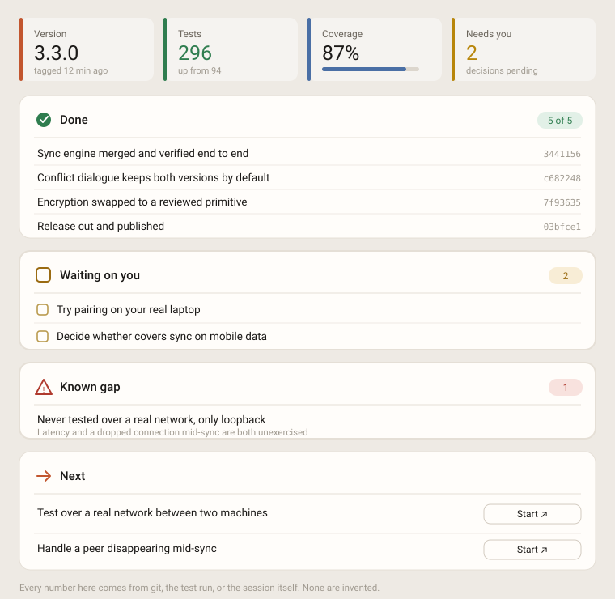

# AuDHD summary

A [Claude Code](https://claude.com/claude-code) skill that makes Claude end long
sessions with a **visual status board** instead of paragraphs.

Claude Code can already render inline visuals. What it does *not* do by default
is decide when to use one, or what shape it should be. This skill supplies that:
gather the real numbers first, then render one scannable board — metric cards,
grouped sections, counts in pills, and a one-click button for each next step.

Built for an AuDHD brain, and useful for anyone who has ever scrolled back
through six paragraphs looking for "so what changed".



*What one looks like at the end of a working session. Adapts to GitHub's light and dark themes.*

## Why

After a long working session, the default is a wall of prose. That's the worst
possible format for the question you actually have — *what's done, what's
broken, what's waiting on me, what's next.*

This skill enforces four things:

- **Real numbers, never invented.** `git log`, the test count, the actual
  conversation. If it isn't known, it isn't shown.
- **Grouped by state, colour-coded.** Done is green, waiting on you is amber,
  blocked is red, next steps are blue.
- **One line per row.** Twelve words maximum. Counts go in pills, not sentences.
- **Exactly one decision at the end.** Commit? Merge? Next batch? One question,
  with buttons.

## Install

Skills live in `~/.claude/skills/`. Copy the folder in:

```bash
git clone https://github.com/izored/Audhd-summary.git
cp -r Audhd-summary/progress-board ~/.claude/skills/
```

On Windows, that's `C:\Users\<you>\.claude\skills\`.

That's it — no config, no dependencies. Claude Code discovers skills in that
folder automatically. Restart your session and it's available.

## Use

Ask for it by name whenever you want one:

> progress board

> where are we

> show me progress

Or invoke it directly with `/progress-board`.

### Make it automatic

The skill only fires when asked. To get a board after *every* substantial piece
of work, add a rule to `~/.claude/CLAUDE.md`:

```markdown
## Session summary — every response

Every response involving work (code changes, fixes, research, multi-step tasks)
must end with a visual status board — the structure from the `progress-board`
skill. Not optional, not "when substantial".

- Grouping, colour, counts and short rows beat prose. Never deliver conclusions
  as paragraphs.
- Always end with ONE clear decision prompt.
- If the session did several things, the board covers all of them — I should
  never have to scroll back to reconstruct state.
```

That combination — skill for the *shape*, CLAUDE.md for the *when* — is what
makes it consistent rather than occasional.

## How it degrades

If the visual tooling isn't available, the skill falls back to the same
structure in markdown: a stats line, one section per group, checkbox lists,
counts in the headings. Still no prose paragraphs.

## What's actually in here

```
progress-board/SKILL.md    the whole thing, ~90 lines
```

One file. Read it — it's short, and you'll probably want to tune the sections to
how you work.

## Tweaking it

Things worth changing for your own use:

- **The sections.** Done / waiting / blocked / next suits solo project work. If
  you're reviewing PRs or triaging bugs, different buckets will fit better.
- **The metric cards.** Version, commits, tests, open items are the defaults.
  Coverage, bundle size and open PRs are just as valid.
- **The tone of the next-step buttons.** They become real prompts when clicked,
  so phrase them as instructions you'd actually send.

## Licence

MIT — see [LICENSE](LICENSE).
